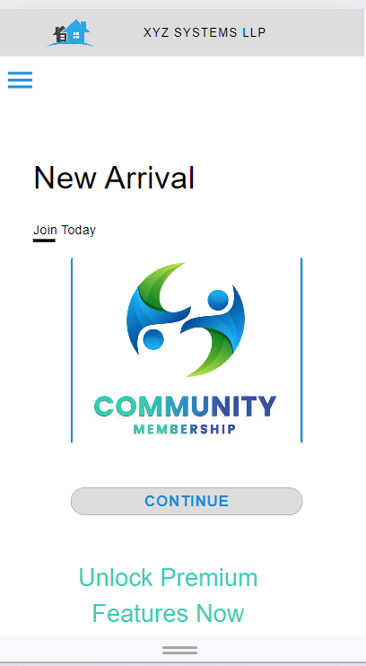
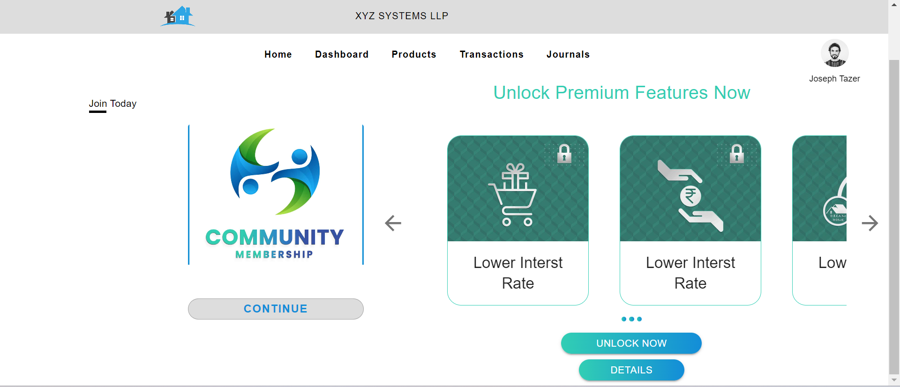
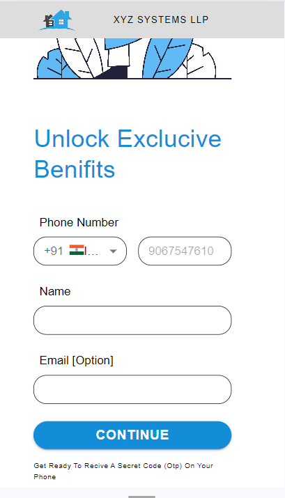
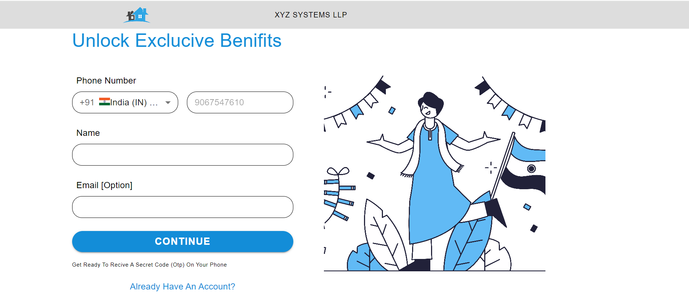
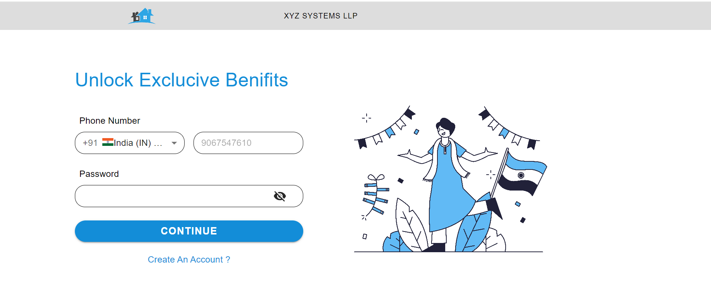
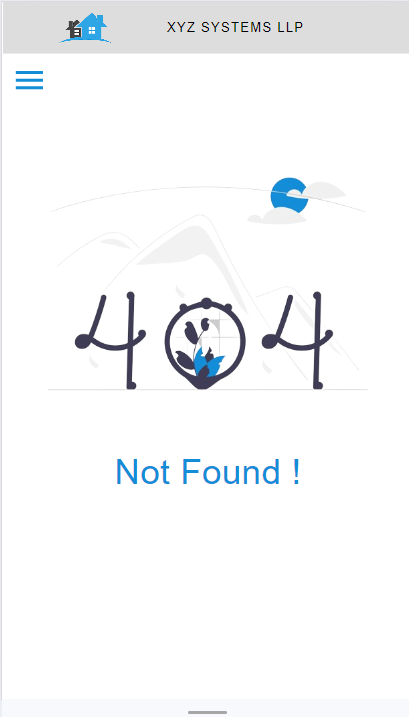
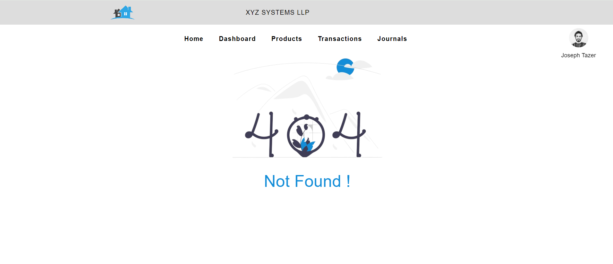

## Run React
```bash
npm i -f
npm start

```

## Run Production
```bash
serve -s build
```
### All Routes Mobile And Web View

1. Home Page Mobile View



2. Home Page Web View



3. Signup Page Mobile View



4. Signup Page Web View



5. Signin Page Mobile View


6. Signin Page Web View



7. 404 Page Mobile View



8. 404 Page Web View




-----

### Git Hub Url

[github url](https://github.com/karotas/IHDC-Assessment)

